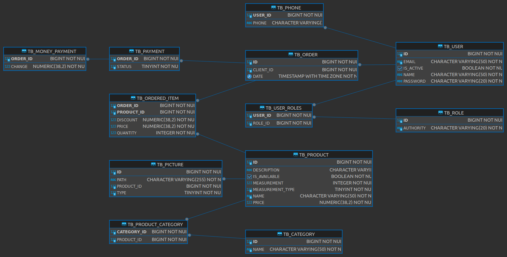

# Controle de Estoque (Desktop)

<p align="justify">
  Neste projeto, foi desenvolvido um aplicativo desktop que visa fornecer recursos de cadastro de usuários, produtos, categorias e a realização de vendas e registro de pagamentos. Para a criação desse projeto, foi utilizado o ecossistema Spring (Spring Boot, Spring Data JPA, Validation, etc.) em conjunto com o JavaFX.
</p>

## 🚀 Começando

<p align="justify">
  Essas instruções permitirão que você obtenha uma cópia do projeto em operação na sua máquina local para fins de desenvolvimento e teste.
</p>

### 📋 Pré-requisitos

- Java Development Kit na versão 21 ou superior (JDK >= 21);
- Gerenciador de dependências Maven (caso deseje executar os comandos via terminal);
- Integrated Development Environment (IDE);
  - Este projeto foi desenvolvido utilizando o `Intellij IDEA Community Edition 2023.3.2`.

### 🔧 Instalação

<p align="justify">
  Abaixo segue o passo-a-passo que informa o que você deve executar para ter um ambiente de desenvolvimento em execução.
</p>

#### Faça o clone do projeto para a sua máquina local:

```
  # HTTPS
  git clone https://github.com/DouglasMonteles/javafx-springboot-application.git

  # SSH
  git@github.com:DouglasMonteles/javafx-springboot-application.git

  # GitHub CLI
  gh repo clone DouglasMonteles/javafx-springboot-application
```

#### Abra o projeto na sua IDE

- No caso do Intellij, vá em: `Open`, selecione o diretório do projeto e clique em `Open as a Project`.
- Neste momento a IDE fará o download das dependências.
- Ao final do download, execute a classe `StoreApplication` dentro de `com.doug.jfx.store`.
  
#### Caso opte por executar os comandos via Terminal

  - No diretório do projeto, dentro de `application` execute:

  ```
  # linux
  ./mvnw spring-boot:run

  # windows
  .\mvnw.cmd spring-boot:run
  ```

Ao final, a janela da aplicação deve ser exibida com a tela inicial de login.

## 📦 Desenvolvimento

<p align="justify">
  O projeto foi criado utilizando o <a href="https://start.spring.io" target="_blank">Spring Initializr</a> e no <strong>pom.xml</strong> foram adicionadas as dependências relacionadas ao JavaFX. Com isso, e algumas modificações na classe de inicialização do projeto, foi possível executar a aplicação JavaFX com o Spring Boot.
</p>

<p align="justify">
  Antes de inciar a implementação das classes, foi criando o <a href="https://www.ibm.com/docs/pt-br/rsas/7.5.0?topic=structure-class-diagrams" target="_blank">diagrama de classes</a> do projeto. Com ele, é possível visualizar as classes e as relações entre elas dentro do projeto, fornecendo uma visão macro da estrutura lógica do projeto.
</p>

<figure>
  
  <center>
    <figcaption>
      Figura 1: Diagrama de classes
    </figcaption>
  </center>
</figure>

<p align="justify">
  Uma vez que as classes foram implementadas e o mapeamento objeto-relacional foi realizado utilizando o JPA, foi possível gerar o <a href="https://www.lucidchart.com/pages/pt/o-que-e-diagrama-entidade-relacionamento" target="_blank">Diagrama Entidade-Relacionamento (DER)</a> do banco de dados, o qual evidencia o relacionamento das tabelas do banco de dados relacional.
</p>

<figure>
  
  <center>
    <figcaption>
      Figura 2: Diagrama Entidade-Relacionamento
    </figcaption>
  </center>
</figure>

### Armazenamento dos dados
<p align="justify">
  Como o objetivo que a criação de uma aplicação desktop, e o usuário deve possuir apenas o arquivo executável para poder utiliza-la, optou-se pela utilização do banco de dados H2 em modo arquivo. Com isso, todos os dados estão sendo armazenados em um banco de dados incorporado a aplicação e que não necessita de instalação separada. 
</p>

### Construção das interfaces
<p align="justify">
  Para a criação das telas com as quais o usuário vai interagir, foram utilizados os .fxml, recurso do JavaFX para a criação de interfaces por meio de tags semânticas. E para tornar a criação das telas mais eficiente, foi utilizado o aplicativo Scene Builder, que fornece um conjunto de componentes de interface do JavaFX e meios de criação de tela onde basta arrastar e posicionar o componente no local desejado da tela.
</p>

### Rotas
<p align="justify">
  Como essa aplicação possui várias telas, achei interessante adicionar um forma de centralizar todas as telas em um único local e ao mesmo tempo facilitar a construção das mesmas. Com isso em mente, criei um <a href="https://docs.oracle.com/javase/tutorial/java/javaOO/enum.html" target="_blank">Enum</a> que possui todas as telas da aplicação instanciadas, e sempre que preciso criar ou abrir uma tela, eu acesso esse enum informando o nome da tela.
</p>

### Upload de imagem
<p align="justify">
  Esse projeto também conta com a possibilidade de upload de imagem ao cadastrar um produto. As imagens são salvas em um diretório interno da aplicação e o caminho relativo é persistido no banco de dados.
</p>

### Funcionalidades implementadas:

CRUD: Create, Recover, Update, Delete.

* CRUD de Categoria;
* CRUD de Usuário;
* CRUD de Produto;
* Venda de Produtos e Listagem de Vendas;
* Confirmação de pagamento e cancelamento da Venda;

## 🛠️ Construído com

Ferramentas utilizadas na criação deste projeto:

* [IntelliJ IDEA Community Edition](https://www.jetbrains.com/idea/download/?section=linux) - Ambiente de desenvolvimento
* [Spring Boot](https://spring.io/projects/spring-boot) - Facilita a criação de aplicativos independentes baseados em Spring de nível de produção que você pode "simplesmente executar".
* [JavaFX](https://openjfx.io/) - Plataforma de aplicativos clientes de código aberto de próxima geração para sistemas desktop, móveis e embarcados construídos em Java.
* [MaterialFX](https://github.com/palexdev/MaterialFX) - MaterialFX é uma biblioteca Java de código aberto que fornece componentes de design de material para JavaFX.
* [Maven](https://maven.apache.org/) - Gerenciador de Dependência
* [Scene Builder](https://rometools.github.io/rome/) - Utilizado na criação das interfaces (janelas)
* [H2 Database](https://www.h2database.com/html/main.html) - Banco de dados da aplicação
* [Lombok](https://projectlombok.org/) - O Projeto Lombok é uma biblioteca java que se conecta automaticamente ao seu editor e cria ferramentas, apimentando seu java.
Nunca mais escreva outro método getter ou equals, com uma anotação sua classe tem um construtor completo, automatiza suas variáveis ​​de registro e muito mais.


## ✒️ Autores

Abaixo estão todos aqueles que ajudaram a levantar o projeto desde o seu início

<center>

|Foto|Nome|Cargo/Função|
|:--:|:--:|:--:|
||<a href="https://github.com/douglasmonteles" target="_blank">Douglas Monteles</a>|Programador Fullstack|

</center>

---
Criado com dedicação por [Douglas Monteles](https://gist.github.com/DouglasMonteles) 😊